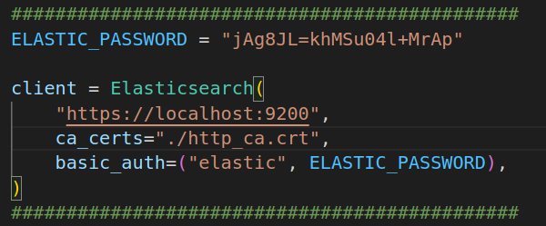
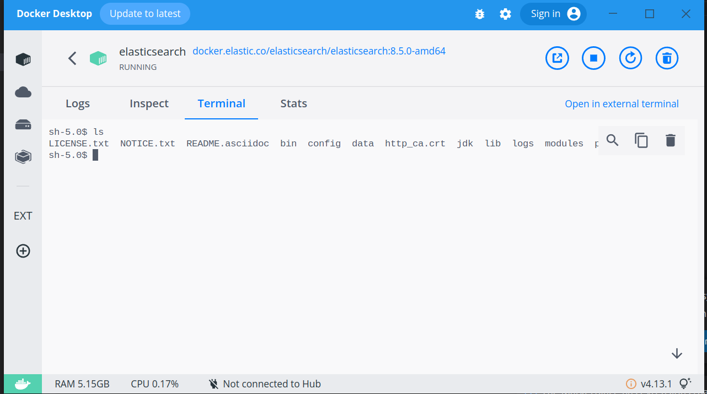

# Anime Recommendation System

## Introduction
Crawl data from MyAnimeList. Use search engine Elasticsearch to recommend anime by user’s preference.

## Install and Run Elasticsearch

Install and Run:

https://github.com/elastic/elasticsearch

Modify the password in anime_recommendation.py:



How to get http_ca.crt:



## How to use the Recommendation System

#### Run the program

```
python anime_recommendation.py
```

#### Login by User Name:

   Type user's name then press Enter.

#### Instructions

* `search {keyword}` : Show top 10 relevant anime.
	
* `add {anime name}` : Add {anime name} to user's anime list. 
	
	Notice: {anime name} has to be the English version. 
	Ex.  Use "Attack on Titan" instead of "Shingeki no Kyojin"
	
	https://myanimelist.net/anime/16498/Shingeki_no_Kyojin
	
	
	
* `remove {anime name}` : Remove {anime name} from user's anime list.
* 	`ls` : List user's anime list.

* `save` : Save user's anime list into the system.
* `recommend` : Recommend 10 anime based on the user's anime list.
* `user feature` : Show the user's features. The features are from the anime's features in user's anime list.
* `exit` : Save and exit.
* `elasticsearch upload` : Upload the data of 3000 anime from anime-list.json to Elasticsearch.
* `elasticsearch delete` : Delete all the anime data on Elasticsearch.

## Crawl Myanimelist

```
python anime_crawl.py
```

Crawl https://myanimelist.net/topanime.php?type=bypopularity to get anime ranked by popularity. I crawl the top 3000 popular anime. The data is saved at './anime-list'.

Install the proper chromedriver for your os if the chromedriver does not work.
